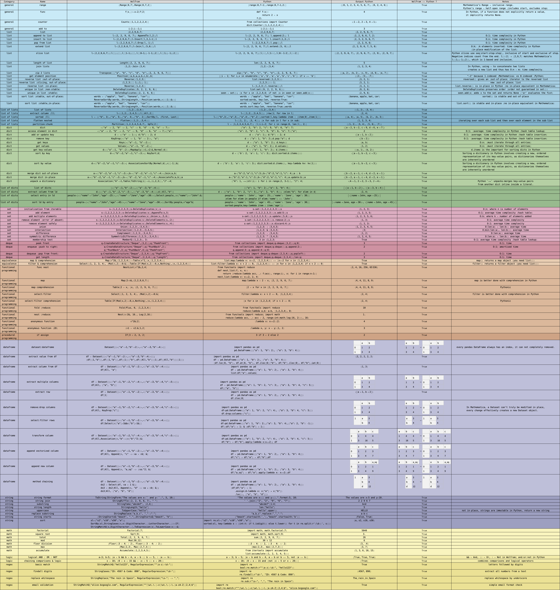

# Wolfram ↔ Python

Welcome to **Wolfram ↔ Python**, a quick reference guide that mirrors common Wolfram Language constructs with their closest Python equivalents. Whether you’re coming from Mathematica and want to prototype logic in Python, or you’re a Pythonista looking to explore Wolfram’s powerful symbolic and functional paradigms, this cheat-sheet will help you translate ideas between the two ecosystems at a glance. Each section groups related operations—everything from basic functions and data structures to functional and procedural programming patterns—so you can jump straight to what you need. Enjoy seamless code translation and unleash the strengths of both languages!

## General

 Name | Wolfram | Python
:---:|:---|:---
range|<pre>{Range[0,7],Range[0,7,2],Range[0,8,2]}</pre>|<pre>[range(0,7+1),range(0,7,2),range(0,8+1,2)]</pre>
func|<pre>f[x_]:=x+2;f[2]</pre>|<pre>def f(x): 	return 2 + x f(2) </pre>
global|<pre>Names["Global`*"]</pre>|<pre>globals()</pre>
print|<pre>Print["Hello world"]</pre>|<pre>print("Hello world")</pre>
print val|<pre>Print["val="<>ToString[5]]</pre>|<pre>print(f"val={str(5)}")</pre>
counter|<pre>Counts[{1,1,2,2,2,4}]</pre>|<pre>from collections import Counter dict(Counter([1,1,2,2,2,4])) </pre>
add to|<pre>i=2;i+=1;i</pre>|<pre>i=2;i+=1;i</pre>
help|<pre>?Sort</pre>|<pre>help(sorted)</pre>

## Dataframe

 Name | Wolfram | Python
:---:|:---|:---
extract value|<pre>df = Dataset[{<\|"a"->1,"b"->2\|>,<\|"a"->3,"b"->4\|>}]; {df[[1,"b"]],df[[1,"b"]],df[[1]]["b"],df[[All,"b"]][1],df[[All,"b"]][[1]]} </pre>|<pre>import pandas as pd df = pd.DataFrame([{"a": 1, "b": 2}, {"a": 3, "b": 4}]) [df.loc[0, "b"], df.at[0, "b"], df.iloc[0]["b"], df["b"].iloc[0], df["b"].iat[0]] </pre>
extract column|<pre>df = Dataset[{<\|"a"->1,"b"->2\|>,<\|"a"->3,"b"->4\|>}]; Normal[df[All, "a"]] </pre>|<pre>import pandas as pd df = pd.DataFrame([{"a": 1, "b": 2}, {"a": 3, "b": 4}]) list(df["a"].values) </pre>
extract row|<pre>df = Dataset[{<\|"a"->1,"b"->2\|>,<\|"a"->3,"b"->4\|>}]; Normal[df[1]] </pre>|<pre>import pandas as pd df = pd.DataFrame([{"a": 1, "b": 2}, {"a": 3, "b": 4}]) df.iloc[0].to_dict() </pre>
extract multiple
columns|<pre>df = Dataset[{<\|"a"->1,"b"->2,"c"->4\|>,<\|"a"->3,"b"->4,"c"->5\|>}]; Normal[df[All, {"a", "b"}]] </pre>|<pre>import pandas as pd df = pd.DataFrame([{"a": 1, "b": 2, "c": 3}, {"a": 3, "b": 4, "c": 5}]) df[["a", "b"]] </pre>
filter rows|<pre>df = Dataset[{<\|"a"->1,"b"->2\|>,<\|"a"->3,"b"->4\|>}]; Normal[Select[df, #a > 1 &]] </pre>|<pre>import pandas as pd df = pd.DataFrame([{"a": 1, "b": 2}, {"a": 3, "b": 4}]) df[df["a"] > 1] </pre>
add vectorized column|<pre>df = Dataset[{<\|"a"->1,"b"->2\|>,<\|"a"->3,"b"->4\|>}]; Normal[df[All, Append[#, "c" -> #a + #b] &]] </pre>|<pre>import pandas as pd df = pd.DataFrame([{"a": 1, "b": 2}, {"a": 3, "b": 4}]) df["c"] = df["a"] + df["b"] df </pre>
transform via apply|<pre>df = Dataset[{<\|"a"->1,"b"->2\|>,<\|"a"->3,"b"->4\|>}]; Normal[df[All, Append[#, "a_sq" -> (#a)^2] &]] </pre>|<pre>import pandas as pd df = pd.DataFrame([{"a": 1, "b": 2}, {"a": 3, "b": 4}]) df["a_sq"] = df["a"].apply(lambda x: x**2) df </pre>
method chaining|<pre>df = Dataset[{<\|"a"->1,"b"->2\|>,<\|"a"->3,"b"->4\|>}]; ds2 = Select[df, #a > 1 &]; ds3 = ds2[All, Append[#, "d" -> #a * #b] &]; Normal[ds3[All, {"a", "b", "d"}]] </pre>|<pre>import pandas as pd df = pd.DataFrame([{"a": 1, "b": 2}, {"a": 3, "b": 4}]) (df[df["a"] > 1]    .assign(d=lambda x: x["a"] * x["b"])    .loc[:, ["a", "b", "d"]]) </pre>

## Dict

 Name | Wolfram | Python
:---:|:---|:---
dict|<pre><\|"a" -> 2, "b" -> 2, "c" -> 9, "d" -> 6, "e" -> 7\|></pre>|<pre>{"a": 2, "b": 2, "c": 9, "d": 6, "e": 7}</pre>
dict access|<pre><\|"a" -> 2, "b" -> 2, "c" -> 9, "d" -> 6, "e" -> 7\|>["a"]</pre>|<pre>{"a": 2, "b": 2, "c": 9, "d": 6, "e": 7}["a"]</pre>
add or update key|<pre>d = <\|"a" -> 1\|>; d["b"] = 2; d</pre>|<pre>d = {"a": 1}; d["b"] = 2; d</pre>
remove key|<pre>KeyDrop[<\|"a" -> 1, "b" -> 2\|>, "a"]</pre>|<pre>d = {"a": 1, "b": 2}; del d["a"]; d</pre>
keys list|<pre>Keys[<\|"a"->1, "b"->2\|>]</pre>|<pre>d = {"a": 1, "b": 2}; d.keys()</pre>
values list|<pre>Values[<\|"a"->1, "b"->2\|>]</pre>|<pre>d = {"a": 1, "b": 2}; d.values()</pre>
items list|<pre>d=<\|"a"->1, "b"->2\|>;MapApply[{#1,#2}&,Normal[d]]</pre>|<pre>d = {"a": 1, "b": 2}; d.items()</pre>
sort by key|<pre>d=<\|"b"->2,"a"->1,"c"->3\|>; KeySort[d]</pre>|<pre>d = {'b': 2, 'a': 1, 'c': 3}; dict(sorted(d.items()))</pre>
sort by value|<pre>d=<\|"b"->2,"a"->1,"c"->3\|>; Association@SortBy[Normal[d],#[[-1]]&]</pre>|<pre>d = {'b': 2, 'a': 1, 'c': 3}; dict(sorted(d.items(), key=lambda kv: kv[1]))</pre>

## Equivalence

 Name | Wolfram | Python
:---:|:---|:---
map & comprehension|<pre>Map[#^2&,{1,2,3,4}]==Table[x^2,{x,{1,2,3,4}}]</pre>|<pre>list(map(lambda x: x**2, [1,2,3,4])) == [x**2 for x in [1,2,3,4]]</pre>
filter & comprehension|<pre>Select[{1, 2, 3, 4}, (Mod[#,2]==0)&]==Table[If[Mod[x,2]==0,x,Nothing],{x,{1,2,3,4}}]</pre>|<pre>list(filter(lambda x: x % 2 == 0, [1,2,3,4])) == [x for x in [1,2,3,4] if x % 2 == 0]</pre>

## Functional programming

 Name | Wolfram | Python
:---:|:---|:---
func nest|<pre>NestList[#^2&,2,4]</pre>|<pre>from functools import reduce def nest_list(f, x, n):     return [reduce(lambda acc, _: f(acc), range(i), x) for i in range(n+1)] nest_list(lambda v: v**2, 2, 4) </pre>
map|<pre>Map[2+#&,{2,2,9,6,7}]</pre>|<pre>map(lambda x : 2 + x, [2, 2, 9, 6, 7])</pre>
map
comprehension|<pre>Table[2 + x, {x, {2, 2, 9, 6, 7}}]</pre>|<pre>[2 + x for x in [2, 2, 9, 6, 7]]</pre>
select / filter|<pre>Select[{1, 2, 3, 4}, (Mod[#,2]==0)&]</pre>|<pre>filter(lambda x: x % 2 == 0, [1,2,3,4])</pre>
select / filter
comprehension|<pre>Table[If[Mod[x,2]==0,x,Nothing],{x,{1,2,3,4}}]</pre>|<pre>[x for x in [1,2,3,4] if x % 2 == 0]</pre>
fold (reduce)|<pre>Fold[Plus, 0, {1,2,3,4}]</pre>|<pre>from functools import reduce reduce(lambda a,b: a+b, [1,2,3,4], 0) </pre>
nest (reduce)|<pre>Nest[#/2&, 16., Log[2,16]]</pre>|<pre>from functools import reduce; import math reduce(lambda acc, _: acc / 2, range(int(math.log(16, 2))), 16) </pre>
anonymous function|<pre>#^2&[2]</pre>|<pre>(lambda x: x**2)(2)</pre>
anonymous function (2D)|<pre>(#1 + #2)&[1,2]</pre>|<pre>(lambda x, y: x + y)(1, 2)</pre>

## List

 Name | Wolfram | Python
:---:|:---|:---
unique list|<pre>Sort[DeleteDuplicates[{2, 2, 9, 6, 7}]]</pre>|<pre>sorted(set([2, 2, 9, 6, 7]))</pre>
list|<pre>{2, 2, 9, 6, 7}</pre>|<pre>[2, 2, 9, 6, 7]</pre>
list append|<pre>l={2, 2, 9, 6, 7}; AppendTo[l,2]; l</pre>|<pre>l=[2, 2, 9, 6, 7]; l.append(2); l</pre>
list slicing|<pre>{2, 2, 9, 6, 7}[[1;;-1;;2]]</pre>|<pre>[2, 2, 9, 6, 7][0::2]</pre>
list length|<pre>Length[{2, 2, 9, 6, 7}]</pre>|<pre>len([2, 2, 9, 6, 7])</pre>
list zip|<pre>Transpose@{{"a", "b", "c", "d", "e"},{2, 2, 9, 6, 7}}</pre>|<pre>zip(["a", "b", "c", "d", "e"],[2, 2, 9, 6, 7])</pre>
out-of-place
reverse list|<pre>Reverse[{1,2,3}]</pre>|<pre>list(reversed([1,2,3]))</pre>
out-of-place
reverse list (slicing)|<pre>{1,2,3}[[-1;;1;;-1]]</pre>|<pre>[1,2,3][::-1]</pre>
in-place
reverse list|<pre>Reverse[{1,2,3}]</pre>|<pre>l=[1,2,3];l.reverse();l</pre>
flatten nested|<pre>Flatten[{{1,2},{3,4}}]</pre>|<pre>import itertools list(itertools.chain.from_iterable([[1,2],[3,4]])) </pre>
element position|<pre>Position[{a,b,c}, b][[1,1]]-1</pre>|<pre>[i for i,v in enumerate(['a','b','c']) if v == 'b'][0]</pre>
random sample|<pre>RandomSample[{1,2,3,4}, 2]</pre>|<pre>import random;random.sample([1,2,3,4], 2)</pre>
list join|<pre>{1,2}~Join~{3,4}</pre>|<pre>[1,2]+[3,4]</pre>
stable out-of-place
sort list|<pre>words = {"apple", "bat", "banana", "car"}; SortBy[words,{−StringLength,−(Position[words,#][[1]]&)}] </pre>|<pre>words = ["apple", "bat", "banana", "car"] sorted(words, key=len, reverse=True) </pre>
stable in-place
sort list|<pre>words = {"apple", "bat", "banana", "car"}; SortBy[words,{−StringLength,−(Position[words,#][[1]]&)}] </pre>|<pre>words = ["apple", "bat", "banana", "car"] words.sort(key=len, reverse=True);words </pre>
partition / chunk|<pre>Partition[{1,2,3,4,5,6}, 2]</pre>|<pre>lst = [1,2,3,4,5,6] [lst[i:i+2] for i in range(0, len(lst), 2)] </pre>

## List of dicts

 Name | Wolfram | Python
:---:|:---|:---
list of dicts|<pre>{<\|"a"->1,"b"->2\|>,<\|"a"->3,"b"->4\|>}</pre>|<pre>[{"a": 1, "b": 2},{"a": 3, "b": 4}]</pre>
extract column (ld)|<pre>d={<\|"a"->1,"b"->2,"c"->5\|>,<\|"a"->3,"b"->4\|>};d[[All,"b"]]</pre>|<pre>d = [{"a": 1, "b": 2, "c": 5},{"a": 3, "b": 4}]; [elem["b"] for elem in d]</pre>

## List of lists

 Name | Wolfram | Python
:---:|:---|:---
list of lists|<pre>{{1,2},{3,4}}</pre>|<pre>[[1,2],[3,4]]</pre>
extract column (ll)|<pre>l={{1,2},{3,4,5}};l[[All,2]]</pre>|<pre>l=[[1,2],[3,4,5]]; [row[1] for row in l]</pre>

## Math

 Name | Wolfram | Python
:---:|:---|:---
factorial|<pre>Factorial[7]</pre>|<pre>import math; math.factorial(7)</pre>
square root|<pre>Sqrt[9]</pre>|<pre>import math; math.sqrt(9)</pre>
total|<pre>Total[{2, 2, 9, 6, 7}]</pre>|<pre>sum([2, 2, 9, 6, 7])</pre>
mod|<pre>Mod[30,12]</pre>|<pre>30 % 12</pre>
floor division|<pre>{Floor[(3 + 4) / 2], Floor[(-3 - 4) / 2]}</pre>|<pre>[(3 + 4) // 2, (-3 - 4) // 2]</pre>
max|<pre>{Max[2,3], Max[{2,7,3}]}</pre>|<pre>[max(2,3), max([2,7,3])]</pre>
accumulate|<pre>Accumulate[{1,2,3,4,5}]</pre>|<pre>from itertools import accumulate list(accumulate([1, 2, 3, 4, 5])) </pre>

## Procedural programming

 Name | Wolfram | Python
:---:|:---|:---
if|<pre>If[3>2,Print["true"]]</pre>|<pre>if 3 > 2:     print("true") </pre>
if assign|<pre>If[3 < 2, 3, 2]</pre>|<pre>3 if 3 < 2 else 2</pre>
for loop|<pre>Do[Print[i], {i, 1, 5}]</pre>|<pre>for i in range(1,6):     print(i) </pre>
while loop|<pre>i = 0; While[i < 5, i++; Print[i]]</pre>|<pre>i = 0 while i < 5:     i += 1     print(i) </pre>
break/exit loop|<pre>For[i = 1, i < 10, i++, If[i > 5, Break[]]]</pre>|<pre>for i in range(1,10):     if i > 5: break </pre>

## String

 Name | Wolfram | Python
:---:|:---|:---
string format|<pre>ToString[StringForm["The values are x=`` and y=``.", 5, 10]]</pre>|<pre>"The values are x={} and y={}.".format(5, 10)</pre>
string join|<pre>StringRiffle[{2, 2, 9, 6, 7}, " "]</pre>|<pre>' '.join(["2", "2", "9", "6", "7"])</pre>
substring|<pre>StringTake["abcdef", {2,4}]</pre>|<pre>"abcdef"[1:4]</pre>
string length|<pre>StringLength["hello"]</pre>|<pre>len("hello")</pre>
uppercase|<pre>ToUpperCase["hello"]</pre>|<pre>"hello".upper()</pre>
replace substring|<pre>StringReplace["a_b_c", "_"->"-"]</pre>|<pre>"a_b_c".replace("_","-")</pre>
string starts|<pre>{StringStartsQ["beach", "_"],StringStartsQ["beach", "b"]}</pre>|<pre>["beach".startswith('_'),"beach".startswith('b')]</pre>

## Parity Test

